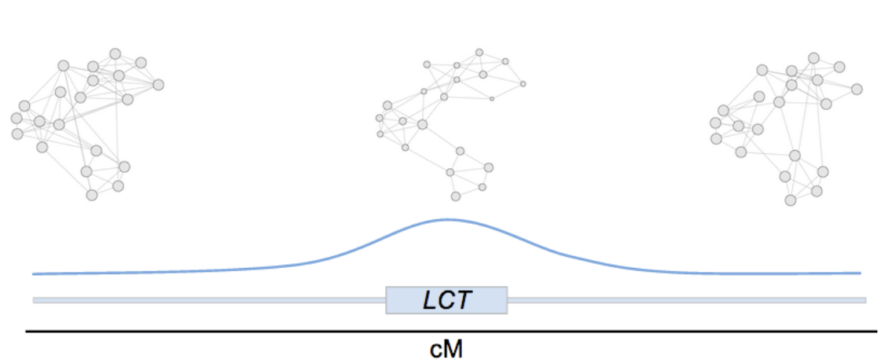

```{r setup, include=FALSE}
knitr::opts_chunk$set(echo = FALSE)
```

# Introduction

Evolutionary and ecological forces that influence among population diversification can be classified as either neutral and putatively adaptive (though see Hahn 2010).  The spatial distribution of neutral genetic variation is the primary source of data used to reconstruct patterns of gene flow and population connectivity (Dyer et al. 2010; 2012), reconstruct historical phylogeography and test phylogeographic hypotheses (Eckert et al. 2008; Garrick et al. 2009), identify spatial patterns of parentage (Nason et al. 1998), estimate relatedness (Queller & Goodnight 1989), and identify transgenic gene escape (Stewart et al. 2003).  Putatively adaptive genetic variance is often identified by means of comparison to neutral structure by looking for signals such as selective sweeps (Pollinger et al. 2005; Voight et al. 2006; Sella et al. 2009), loci with increased population structure (Coop et al. 2009), and correlations between allelic variation and bioclimatic factors (Coop et al. 2010; Eckert et al. 2010a).  Adaptive variance is constrained, historically, by neutral demographic history resulting in spatial genetic signatures even with genomic regions experiencing strong selective pressure (Nielsen 2005, Coop et al. 2010).  Teasing apart the confounding signals of selection with linked variants (e.g., Maynard Smith and Haigh 1974; Hermisson and Pennings 2005; Stephen et al. 2006; McVean 2007) from genome-wide patterns due to neutral history is an ongoing methodological challenge, a task that is becoming increasingly difficult with the increasing size of genomic datasets (Stapley et al. 2010, Barrett and Hoekstra 2011).

A common approach to identify genomic regions carrying signatures of selection is to estimate parameters such as nucleotide diversity (π or some function of nucleotide diversity such as Tajima’s D; Nielsen et al. 2005), linkage disequilibrium (Nielsen 2005), or population divergence (FST; Beaumont & Balding 2004; Foll & Gaggiotti 2008) and compare them to expectations based upon neutral theory and a priori demographic models (e.g., Chen et al. 2012).  Natural selection affects magnitudes of these parameters, as for example the larger values of FST, increased levels of linkage disequilibrium, and decreased values of nucleotide diversity expected at regions experiencing selective sweeps due to directional selection. While an approach based on a single parameter provides evidence for the presence of selection localized within genomes, it provides few insights into how selection operated differentially among populations and may suffer from problems of identifiability of causative processes.  

Here we introduce the use of an additional approach, rather than estimating individual statistics to identify the presence of selection, we propose the use of conditional covariance networks (e.g., Population Graphs) that will characterize how selection has influenced the pattern of among population genetic covariance.  Changing the focus from the magnitude of a single statistic like FST to the topological shape of a covariance network also provides opportunities for subsequent categorization of non-neutral genomic regions and an a priori hypothesis testing framework.  We begin with a brief review of conditional genetic covariance and how it is used in Population Graphs.  Simulations are used to identify a set of graph-theoretic parameters that change under the operation of selection (both positive and negative) differentiating from those expected due to neutral processes and some forms of demography.  This approach was applied to an example dataset, the HGDP-CEPH dataset for chromosome 2, for which we have numerous examples of positive selection in the global human population.


# Materials & Methods

*Population Graphs*

A Population Graph (popgraph hereafter from Dyer & Nason 2004, Dyer 2015) is a mathematical graph, $G$, defined by conditional genetic covariance (Whittaker 1990), whose purpose is to describe the spatial distribution of genetic covariance among sampled locales.  Each popgraph is constructed solely from population genetic data and consist of two components, nodes and edges.  The node set, $V=\{v_1,v_2, \ldots, v_k\}$, represent sampled populations, each of which has a size associated with it that is scaled to the within population multilocus genetic variance, $\sigma_w^2$.  Pairs of nodes may be connected by an edge set, $E=\{e_1,e_2,\ldots ,e_m\}$, whose presence is determined by conditional genetic covariance (Dyer 2015).  Edge lengths are weighted relative to the contribution the pair of populations contribute to the overall estimate of among strata genetic covariance as
\[
\sigma_A^2=\sum_{i\ne j}^K \sigma_{A; i \leftrightarrow j}^2
\].

This decomposition is fundamentally different in that what we are doing is partitioning the total among strata genetic covariance and not the sample covariance based upon allele frequencies across populations (Dyer & Nason 2004).


 Two populations are said to be conditionally independent if and only if they have zero covariance after conditioning their individual variances on the rest of the dataset.  As defined,  nodes $v_i$ and $v_j$ are conditionally independent of each other given the rest of the nodes $v_{k;\;\forall k≠i,j}$ if and only if:

\[
v_i ⟂ v_j | v_k = P(v_i ∩ v_j | v_k) = P(v_i|v_k)P(v_j|v_k)
\]


Nodes found to be conditionally independent in a Population Graph not connected, even though the unconditional covariance between them may deviate from zero. 

Biologically, conditional genetic independence can arise under several scenarios. For example, consider a source-sink demographic model.  Divergence among sink populations will be small (e.g., they will have high covariance) even if there is no inter-sink gene flow because they all receive migrants from the same source population.  Conditionally though, sink populations will be genetically independent, conditional on how they covary with the source population.  The net result of conditional covariance is that it more closely resolves the underlying demographic model than pairwise approaches that only consider a subset of the data.  The Population Graph G={V,E} is a also an independence graph with pairwise, local, and global Markov properties.  This means that populations not directly connected within the topology are statistically independent conditional on how they covary with the rest of the nodes in the network.  Changing the node set by adding or removing a population modifies the entire covariance structure, since all edges are based upon the totality of the network (cf., Koen et al. 2013). 

The fundamental characteristic of a Population Graph is the underlying conditional covariance topology, created in large part by the historical demographic history of populations (Lowry et al. 2008, Baker & Dyer 2011, Garroway et al. 2011, Dyer et al. 2012, Traoré et al. 2012, Winkler et al. 2012).  All other analyses are based upon either the magnitude of structure or the amount of diversity relative to a null model.  This changes the focus of the analysis from interpreting a set of indices to analyzing the multivariate shape of population covariance.  For example, different evolutionary histories can lead to indistinguishable FST estimates, whereas the topologies evolved in these scenarios create divergent topological shapes (Figure X-Interpretive, three panel, same Fst different shapes).  

Conditional genetic covariance as implemented in Population Graphs also experience a more rapid trajectory towards variance stabilization when compared to pairwise parameters (Dyer 2007) making it more responsive to changes and can provide increased resolution (e.g., a net increase in R2 in isolation by distance scenarios) in describing the spatial distribution of genetic variation (Dyer et al. 2010).  A Population Graph topology is defined as a ‘model-free’ analysis of genetic covariance even though certain structural features of the network are correlated with common population genetic parameters (Dyer 2007).  For example, node connectivity is correlated with genetic structure (e.g., FST 𝜌 = -0.95) and the diameter of the graph is related to the regression coefficient for analysis of isolation by distance (𝜌 = -0.98).  The derived topology of genetic covariance can be converted into a measure of genetic distance, called cGD (Dyer et al. 2010), which is both more sensitive to demographic changes and provides a higher level of precision than normal pairwise structure and distance parameters (Dyer et al. 2010).  As with all genetic distances, cGD is represented as a matrix of pairwise distances, however cGD is derived from the topology of the conditional covariance graph rather than isolated pairs of strata.

Adopting a topological analysis provides a distinctly different focus than that based upon estimation and interpretation of individual parameters.  At a fundamental level, individual estimators of structure and diversity, such as FST and π, are defined based upon an overall magnitude, that is compared to estimates from other regions of the genome.  Divergence in excess of the background level is one way to identify the footprints of selection, though it is not the only way.  A Population Graph topology says relatively little about the magnitude of variation but rather describes how that variation is distributed across populations.  

It is precisely the way in which the topological shape changes as we walk down a chromosome that allows us to identify genomic regions between neutral and selective generating processes and to gain inferences about the ways in which alternative selection processes have shaped different genomic regions.  

```{r fig.caption = "A conceptual model of chromosome walking in the region of the human Chromosome 2 in the vacinity of the LCT locus.  Topological covariance amongst sampled populations is estimated within overlapping SNP windows (top).  In the vicinity of regions under selection, the covariance topology of the deviate from that described from neutral covariance (blue line). "}


```


¶ Paragraph on topological classification & comparisons (Box for measurements)

*Simulations*

Adopting a simulation approach, we expand the analyses from Dyer (2007) to determine which sets of graph-theoretic features within a Population Graph topology are sensitive to the action of selection (both positive and negative).  From simulated data we quantify the effects of selection on parameters describing features of nodes, edges, and the overall topological shape.  Node parameters include degree (the number of edges connected to a node), node betweenness (the number of shortest paths through the entire topology that go through this node), node closeness (the distance from a node to all others in the topology), and cGD (a measure of pairwise conditional distance based on shortest paths).  For edges, we also edge betweenness (an analogous measure quantifying the relative number of shortest paths that traverse a particular edge).  Changes in overall graph structure are estimated using the slope degree (a measure of the degree distribution that differentiates scale free graphs from random networks) and graph diameter (the length of the path connecting the most distant nodes in a network).  These parameters will serve as a multivariate description of topological structure.

To determine if selection the way in which a Population Graph topology is constructed, we used forward time simulations under a Wright-Fisher model with demography and natural selection.  A set of twenty-five populations were defined with Θ = 4Neµ = 5.0 arranged in a one-dimensional stepping-stone configuration with symmetric migration between neighboring populations at a rate equal to Nem = 9.5.  Simulations were iterated to allow burn-in for 50Ne generations after which 25 individuals were randomly selected and 100 unlinked SNP loci were retained.  This process was replicated 100 times under three different evolutionary scenarios for a subset of loci: neutrality (hereafter NEU), negative (purifying) selection (NEG), and positive (directional) selection (POS).  The non-neutral replicates (NEG & POS) were simulated such that a fraction of the new mutations (we used 70%) in 20% of the populations were either deleterious or advantageous (2Nes = 50).  In the remaining 80% of the populations, these loci were neutral. Thus, our simulations are essentially those of a model of local adaptation via conditional neutrality, which is a difficult case to detect using traditional population genetic methods (Tiffin & Ross-Ibarra, 2014).  We desired the majority of populations to evolve neutrality and for the remaining to have moderately strong magnitudes of selection in order to quantify the performance of this method with obvious signals of selection. The parameters of the underlying migration model and selection regimes were chosen for generality and were not intended to mimic specific life histories, though they are consistent with other simulation approaches applied in quantifying model performance.  All simulations were performed using the Selection on Finite Sites under COmplex Demographic Events (SFS_CODE) from Hernandez (2008).  At the end of each simulation, multilocus genotypes were used to estimate a Population Graph with the gstudio library (http://github.com/dyerlab/gstudio) in R (R Core Team 2016).  Graph-theoretic parameters were extracted from each topology using functions from the igraph (Gabor & Nepusz 2006) and popgraph (http://github.com/dyerlab/popgraph) libraries in R.  Fixed effects ANOVA and TukeyHSD post-hoc tests were used to identify significant differences of graph-theoretic parameters among treatments of NEU, NEG, and POS selection regimes using R. 

*HGDP-CEPH Chromosome 2*

To demonstrate the utility of Chromosome Walking we used the Human Genome Diversity Project (HGDP) - CEPH SNP dataset for chromosome 2. Due to the highly complex evolutionary history associated with the rather recent emergence of our species, patterns of demography and natural selection are challenging to tease apart, especially with respect to bouts of recent directional selection and local adaptation (Tishkoff and Verrelli 2003a; Tishkoff and Verrelli 2003b). Although whole genome datasets are emerging for select samples, few available datasets compared to the HGDP-CEPH dataset that includes over 1 million SNP loci genotyped in ~1,050 unrelated individuals sampled from 52 ethnically and geographically diverse populations of Africa, Europe, the Middle East, South and Central Asia, East Asia, Oceania and the Americas. This dataset has been an extensive resource in characterizing human population ancestry (e.g., Cann et al. 2002; Rosenberg et al. 2002), as well as identifying signatures of natural selection at the genome and single gene levels (e.g., Sabeti et al. 2007), from a global perspective. Several strong candidates for positive selection have been revealed on chromosome 2 (Voight et al. 2006; Pickrell et al. 2009), and in fact, one of the more championed signatures of recent directional selection in this dataset is found at the lactase (LCT) gene (Bersaglieri et al. 2004), as evidenced by significantly high FST and unusually long haplotype blocks associated with lactase persistence alleles. Thus, as an initial “proof-of-concept” example, the chromosome 2 dataset, which includes 42,588 genotyped SNPs in the HGDP-CEPH panel, represents a perfect candidate with which to apply our approach, especially given the opportunity to include the LCT gene in our analyses. 

We analyzed among-population covariance on these data by estimating Population Graph topologies sequentially (Figure 1) along chromosome 2, using partially overlapping sets of SNP loci. The size of the sampling window is dependent upon SNP density and overall genetic diversity.  More loci are always preferable, though their cumulative contribution is highly asymptotic with respect to the shape of the resulting topology.  Increasing the number of loci used to estimate a single topology also results in a larger window along the chromosome, which we are interested in minimizing.  To find an optimal window size for this example data set, we subsampled contiguous stretches of SNPs in sets of 10, 20, 30, 40, 50, 60, 70, and 80 loci at random starting locations from the set of all 42,588 available SNPs.  For each window size, we sampled 100 topologies.  We selected the smallest window size whose variance in number of edges in the resulting topologies had stabilized. 
rphological) to scan genomes for congruent covariance structure due to selection.  We close by discussing the utility and limitations of using a Population Graph approach in characterizing non-neutral genetic covariance.


# Results

*Simulations*

Across simulations, selection was observed to cause significant changes in all graph-theoretic parameters except for slope degree (Table 1). More on patterns in Table 1.  This was a negative control in our parameters, selection should not have changed the degree distribution of the overall topology from a random network to a scale-free one.  Population Graphs based upon neutral genetic variance do not exhibit small-world dynamics (Klüetch et al. 2012), and we have no indication that the inclusion of selection will make such drastic alterations of network connectivity.  From the data, signatures of positive selection in topological features include significant reductions in degree and closeness, as well as increases in betweenness (both node and edge), cGD, and diameter.  Signatures of negative selection are not surprisingly less pronounced, though show significant differences between NEG and NEU for both closeness and cGD.  The covariance structure of populations appear to change in predictable and significant ways due to selection acting on new mutations within a one-dimensional stepping stone model.  As expected, the signature of positive selection is much more pronounced than that driven by negative selection.  


```{r tab_simulations}
caption <- "Summaries of differences in graph topological features due to negative, neutral, and positive selection regimes.  For each topological parameter, a fixed effect ANOVA was conducted (F and P shown) and mean differences are depicted as the probability of differences in treatment mean from a Tukey HSD."
```


*HGDP-CEPH Chromosome 2*

Subsampling contiguous stretches of SNPs and measuring the likelihood of edge occurrence showed stabilization in the variance at 40 SNPs (Figure 2).  A window size of 40 SNPs yielded 6378 overlapping topologies spanning the entire chromosome.  For each sequential topology, we skipped a quarter of the SNP’s such that neighboring topologies shared 75% of their loci as we are interested in smoothing out trends in topological shape changes along the chromosome.  The distribution of window sizes along human chromosome 2 that contain 40 contiguous SNPs appeared approximately lognormally distributed (Supplementary Figure 1). The physical size of a 40 SNP window ranged in length from 37-6,331 kbp, with a median size of 195 kbp, a length in line with other ‘outlier’ methods used to identify putatively non-neutral genomic regions (e.g., Voight et al. 2006).  For each window, we estimated average diversity HE=0.341 (range 0.210-0.419) and population structure FST= 0.146 (range 0.05-0.38).  Averaged across a window, extreme values (both large and small) of both diversity and structure are modulated; the maximum FST recorded was 0.722 found at SNP rs6719593 (nested within the ARMC9 locus).  When comparing outlier topologies below we will contrast the inferences from window multilocus FST and maximum FST in the window (see Supplementary Figure 2 for the effects of window averaging).

Graph-theoretic parameters identified through simulations as being indicative of directional selection (Table 1) were estimated for all 6378 topologies along chromosome 2.  Individually, these parameters deviate in the physical proximity of regions  


 and used as a ranking index to ordinate the Population Graphs.  Topologies with a low ‘Topological Index’ have shape characteristics that are consistent with those found under positive selection, whereas topologies with a high Topological Index have properties divergent from what is expected under positive selection.  Across all topologies, the index was negatively correlated with the maximum divergence, FST;max, estimated for each window (Pearson 𝜌=-0.242; t = -8.8793, df = 1273, P < 2.2e-16; n.b., only non-overlapping topologies were used to minimize lack of independence).  Defining a cutoff level is somewhat arbitrary


The top 1% simultaneous outlier topologies were examined (Figure 3) and using NCBI dbSNP, annotated gene products in topology windows were identified (Table 2).  This is suggestive that genomic regions underlying traits experiencing a variety of selection regimes can be identified using Population Graphs, as sweeps due to directional selection on new (hard sweeps) and standing (soft sweeps) variation, FST outliers signifying diversifying selection across population s, and regions associated with quantitative traits were all identified.

The way in which the suite of graph-theoretic parameters change in the vicinity of a genomic region deviating from neutrality can also provide indications of the physical extent of topological change.  This can be represented in a manner similar to what is used for selective sweeps.  For illustrative purposes, we ranked all topologies on the features consistent with directional selection (Table 1) and then developed a ‘composite’ (additive) rank across all parameters.  The most divergent topology was 1446 previously identified as a soft selective sweep by Pickrell et al. (2009) using the iHS haplotype test from Voight et al. (2006). Thus, as with statistics based on the site-frequency spectrum, graph-theoretic statistics derived from Population Graphs can be related to the local degree of linkage disequilibrium and level of recombination.

While deviations from neutral topologies can also identify regions deviant from null models or genome-wide expectations, there are two additional inferences that a topological approach  provides that single parameter approaches cannot: (1) non-outlier topological divergence and (2) isomorphic topological classification.  

*Non-Outlier Topological Divergence*

The use of outliers to identify putatively adaptive genomic regions relies upon the assumption that positive selection skews allele frequency spectra.  However, there are several scenarios under which among populations can change while having no effect on overall population divergence.  Examples include any process that leads to localized changes in Ne (e.g., variance in recombination), models of polygenic adaptation where fitness differences among individuals in different populations, etc.  The salient points here are threefold.  First, there are mechanisms that would prevent the identification of genomic regions whose covariance has changed that are not manifest in an large increases in FST.  To illustrate, we order the topologies in descending outlier rank (lower numbers being more representative of positive selection) and plot their associated maximum FST (Figure 5; linear model F=148.3; df=1,2116, R2 = 0.065, P < 2.2x10-16).  Some topological outliers (low ranks) also have high FST (Figure 5, points in the upper left quadrant), though many topologies have a shape indicative of positive selection with FST in the sampling window of much lower magnitude (Figure 5, lower left quadrant).  The largest FST observed occurs in the topology that is ranked 159th (~8th percentile) in terms of outlier shape.  

Second, even for genomic regions whose covariance structure is consistent with a model of directional selection, there is no guarantee that these changes will be manifest in the mere amount of among population genetic variance present.  In these data, the most outlier-like topologies not only exclude the most structural divergent regions of Chromosome 2, the most divergent ones differ in the level of population structure by a factor of 2X (FST ranges from 0.31-0.62; Figure 6).  Upon closer inspection, and perhaps more important to the larger understanding of how selection modifies populations, even outlier topologies that have an equivalent degree of structure (e.g., same FST) have divergent patterns of connectivity.

Finally, we would be remiss if we did not highlight the fact that the criteria defining a topology as being an outlier in these analyses are based upon a model of directional selection.  As such, there are other genomic regions on Chromosome 2 that have high structural divergence (Figure 5, upper right quadrant) and low outlier rank for these combinations of .  Here deviation from neutrality that led to increased population divergence was not due to selection acting in a way consistent with positive selection, relegating their interpretation for subsequent analyses based upon alternative selection scenarios.  Given the length of the current manuscript, we are sequestering subsequent work describing the quantitative topological differences of alternative selection regimes into a latter paper.
Isomorphic Topological Classification

Given that several population covariance scenarios may lead to the same numerical value of a structure statistic such as FST (or any measure of genetic diversity) categorizing topologies,  based upon network structure parameters such as degree, node betweenness, closeness, cGD, edge betweenness, and diameter facilitate an unsupervised clustering of inter-population genetic covariance.  Using Ward’s D (after Murtagh & Legendre 2013), topologies seem to fall into three generalized groups (Figure 7).  The differences between outlier rankings separate the three groups (Kruskal Rank Sum Test; 𝜒2=1588.178, df=2, P < 2.2x10-16) as do mean FST values (ANOVA; 


similarity in inter-population genetic covariance connections in these topologies, provides a tool that has been previously unavailable.  


This allows entirely new types of hypotheses to be addressed.  These hypotheses can be based upon existing genetic covariance structure, phenotype, or indeed even external environmental features.  In this last section we demonstrate how one can investigate topological similarity.

, “Where else in the genome has selection caused genetic covariance to deviate from neutrality in the same way as it has for LCT?” on phenotype “Where

# Discussion

A fundamental distinction that topological approaches provide is that we can partition genomic regions previously lumped as ‘outlier’ into distinct categories based upon the way in which selection changes genetic covariance.  For example, Figure 5 shows a ranking of topologies based upon a model of directional selection and their corresponding structure statistics.  Not all high Fst regions are also identified as having genetic covariance configured in a way consistent with directional selection (e.g., high Fst points on the left of Figure 5).  There are many other evolutionary mechanisms that can result in high SNP divergence beyond directional selection.  blah blah blah {we need more of this}


{Brian this is your paragraph} Limitations with respect to genome architecture and finding ‘topological signatures of selection’  
max Fst vs multilocus Fst
balancing or diversifying selection is (1-p) p=directional selection.  We have scaled our topological outliers by directional.  1-p = other high Fst regions most unlike directional selection.

A few points should be made here regarding sampling.  First, the window size used here is appropriate for the data we are currently analyzing. Other taxa with differential SNP density may find other more appropriate window sizes.  Second, the physical size of the sampling window for each topology is variable and depends upon the local SNP density, the more dense SNP loci sampled, the more specific the topology can capture changes in among-strata covariance.  Third, we overlap the windows sequentially along the chromosome such that we can capture the way in which topologies change as a function of local deviation from neutral processes.  Lastly, while we chose these data specifically because they have been used extensively in other analyses of selection, there is no reason why this approach cannot be applied to other taxa even if they do not have complete genomes; topologies can be estimated along contigs just as easily as they can for mapped chromosomes.

Post-hoc justification of gene function is story-telling and can be misleading (see Pavlidis et al. 2012 in MBE)

¶3 Numerator of Fst is sum of covariances, which is how we get conditional genetic distances. Leads into next ¶.  Magnitude under models of selection is not different from background (Latta Kremer, berger & goldfarb, et al.)

¶4 Lifting Legs on Future Topics. 
Discussion on Isomorphic Congruence: External evidence may suggest a topological configuration upon which a genome can be scanned. For example, moisture is of interest, you can define a topology among populations based upon rain and then scan for all genomic regions that have a similar topological configuration thereby reversing the normal process of things (e.g., finding outliers and then trying to find things they correlate with).
Epistatic relationships. It is possible to find genomic regions that may have either a) epistatic relationships or b) have responded to selection in a similar way (see similar topologies above). Holliday et al. 2012 spruce using randomforest shit.
Consequences of LD: How much should we be concerned with? (ANDREW)  Simulations on other landscapes?
Explore the genome for example.  - FUTURE STUDIES
identify not only simple genomic regions on the same chromosome but also across the entire genome.
adaption on multiple loci


¶5 To be done
Signatures of positive selection result in frequency changes in the following ways … As such, we would expect more centrality because….  Use example (BRIAN)


¶6 (ANDREW) Make statements about only valid for genomes with annotation and lots of information.  
GWAS associated SNP’s vs. background
Candidate gene smps

¶ Parts

Several avenues of ongoing methodological development have sought to tackle this problem.  For example, Bayescan (Foll & Gaggiotti 2008) can be used to partition overall allelic divergence (FST) into components to differences among both loci and populations.  Berg & Coop (2014) use a different approach to leverage the additive effect sizes from genome-wide association studies with allelic (FST) and phenotypic (QST) divergence among populations to identify signals of selection and are able to discern which populations are driving the formation of this signal.  Most importantly though, there are many different demographic scenarios that produce the same value of a parameter such as FST.

There are some limitations to this method.  First, it is reliant on having a good estimate of within stratum variation (W2).  Covariance is estimated using the inverse of within group variance and having either no or poorly estimated W2 leads to poor efficiency.  The number of loci required depend upon their variation, the strength of the underlying signal, and the underlying pattern of differentiation in a way that is similar to any statistical genetic analysis.  A corollary of this is that Population Graphs are also limited to sampling schemes based upon population differences rather than individual differences.  Individual based studies in landscape genomics (e.g., Sork et al. 2013) will find this approach problematic in its current form.  


¶8 Conclusion


# Acknowledgements


# References

Baker SA, Dyer RJ. (2011) Invasion genetics of Microstegium vimineum (Poaceae) within the James River Basin of Virginia, USA. Conservation Genetics, 12, 793-803
Barrett RDH, Hoekstra HE. (2011) Molecular spandrels: tests of adaptation at the genetic level. Nature Reviews Genetics, 12, 767-780.
Balding DJ, Nichols RA. (1996) A method for quantifying differentiation between populations at multi-allelic loci and its implications for investigating identity and paternity. Genetica, 96, 3-12.
Ballard D, Abraham C, Cho J, Zhao H. (2010) Pathway analysis comparison using Crohn’s disease genome wide association studies. BMC Medical Genomics, 3, 25.
Barrenas F, Chavali S, Holme P, Mobini R, Benson M. (2009) Network properties of complex human disease genes identified through genome-wide association studies. PLoS One, 4, e8090.
Beaumont MA. (2005) Adaptation and speciation: what can F(ST) tell us? Trends in Ecology and Evolution, 20, 435-440.
Beaumont MA, Balding DJ. (2004) Identifying adaptive genetic divergence among populations from genome scans. Molecular Ecology, 13, 969-980.
Berg JJ, Coop G.  2014.  A population genetic signal of polygenic adaptation.  PLoS Genetics, 10, e1004412. doi: 10.1371/journal.pgen.1004412.
Chen J, Kallman T, Ma X, Gyllenstrand N, Zaina G, Morgante M, Bousquet J, Eckert A, Wegrzyn J, Neale D, Lagercrantz U, Lascoux M. (2012) Disentangling the roles of history and local selection in shaping clinal variation of allele frequencies and gene expression for photoperiodic genes in Norway spruce (Picea abies). Genetics, 191, 865-881.
Conrad DF, Jakobsson M, Coop G, Wen X, Wall JD, Rosenberg NA, Pritchard JK. (2006) A worldwide survey of haplotype variation and linkage disequilibrium in the human genome. Nature Genetics, 38, 1251-1260.
Coop G, Pickrell JK, Novembre J, Kudaravalli S, Li J, Absher D, Myers RM, Cavalli-Sforza LL, Feldman MW, Pritchard JK. (2009) The role of geography in human adaptation. PLoS Genetics, 5, e1000500.
Coop G, Witonsky D, Di Rienzo A, Pritchard JK. (2010). Using environmental correlations to identify loci underlying local adaptation. Genetics, 185, 1411-1423.
Dyer RJ. (2007) The evolution of genetic topologies. Theoretical Population Biology, 71, 71-79.
Dyer RJ, Nason JD. (2004). Population Graphs - the graph theoretic shape of genetic structure. Molecular Ecology, 13, 1713-1727.
Dyer RJ, Nason JD, Garrick RC. (2010) Landscape modeling of gene flow: Improved power using conditional genetic distance derived from the topology of population networks. Molecular Ecology, 19, 3746-3759.
Dyer RJ, Chan DM, Gardiakos VA, Meadows CA. (2012) Pollination Graphs: Quantifying pollen pool covariance networks and the influence of intervening landscape on genetic connectivity in the North American understory tree, Cornus florida L. Landscape Ecology, 27, 239-251.
Eckert AJ, Tearse BR, Hall BD. (2008) A phylogeographical analysis of the range disjunction for foxtail pine (Pinus balfouriana, Pinaceae): the role of Pleistocene glaciation. Molecular Ecology, 17, 1983-1997.
Eckert AJ, Bower AD, Pande B, Jermstad KD, Krutovsky KV, St. Clair JB, Neale DB. (2009) Association genetics of coastal Douglas fir (Pseudotsuga menziesii var. menziesii, Pinaceae). I. Cold-hardiness related traits. Genetics, 182, 1289-1302.
Eckert AJ, Bower AD, Gonzalez-Martinez SC, Wegrzyn JL, Coop G, Neale DB. (2010a) Back to nature: ecological genomics of loblolly pine (Pinus taeda, Pinaceae). Molecular Ecology, 19, 3789-3805.
Eckert AJ, van Heerwaarden J, Wegrzyn JL, Nelson CD, Ross-Ibarra J, Gonzalez-Martinez SC, Neale DB. (2010b) Patterns of population structure and environmental associations to aridity across the range of loblolly pine (Pinus taeda L., Pinaceae). Genetics, 185, 969-982. 
Foll M, Gaggiotti O. (2008) A genome-scan method to identify selected loci appropriate for both dominant and codominant markers: a Bayesian perspective. Genetics, 180, 977-993.
Fumagali M, Sironi M, Pozzoli U, Ferrer-Admetlla, Pattini L, Nielsen R. (2011) Signatures of environmental genetic adaptation pinpoint pathogens as the main selective pressure through human evolution. PLoS Genetics, 7, e1002355.
Gabor C, Nepusz T.  2006.  The igraph software packages for complex network research.  Interjournal: Complex Systems, 1695.
Garrick RC, Nason JD, Meadows CA, Dyer RJ. (2009) Not just vicariance: Phylogeography of a Sonoran desert euphorb indicates a major role of range expansion along the Baja peninsula. Molecular Ecology, 18, 1916-1931.
Garroway CJ, Bowman J, Wilson PJ.  2011.  Using a genetic network to parameterize a landscape resistance surface for fishers, Martes pennanti.  Molecular Ecology, 20, 3978-3988.
Hahn M. (2008) Towards a selection theory of molecular evolution. Evolution, 62, 255-265.
Heinonen P, Koulu M, Pesonen U, Karvonen MK, Rissanen A, Laakso M, Valve R, Uusitupa, Scheinin M. (1999). Identification of a three-amino acid deletion in the alpha2B-adrenergic receptor that is associated with reduced basal metabolic rate in obese subjects. Journal of Clinical Endocrinology and Metabolism, 84, 2429-2433. 
Hermisson J, Pennings PS. (2005) Soft sweeps: molecular population genetics of adaptation from standing genetic variation. Genetics, 169, 2335-2352.
Hernandez, RD. (2008) A flexible forward simulator for populations subject to selection and demography. Bioinformatics, 24, 2786-2787.
Hindorff LA, Sethupathy P, Junkins HA, Ramos EM, Mehta JP, Collins FS, Manolio TA. (2009) Potential etiologic and functional implications of genome-wide association loci for human diseases and traits. Proceedings of the National Academy of Sciences USA, 106, 9362-9367.
Holliday JA, Wang T, Aitken S. (2012) Predicting adaptive phenotypes from multilocus genotypes in Sitka spruce (Picea sitchensis) using random forest. Genes, Genomes and Genetics, 2, 1085-1093.
Kathiresan S, Musunuru K, Orho-Melander M. (2008) Defining the spectrum of alleles that contribute to blood lipid concentrations in humans. Current Opinion in Lipidology, 19, 122-127.
Klütsch CFC, Dyer RJ, Misof B.  2012.  Combining multiple analytical approaches for the identification of population structure and genetic delineation of two subspecies of the endemic Arabian burnet moth, Reissita simonyi (Zygaenidae; Lepidoptera).  Conservation Genetics, 13, 21-37.
Koen EL, Bowman J, Garroway CJ, Wilson PJ.  2013.  The sensitivity of genetic connectivity measures to unsampled and under-sampled sites.  PLoS One, 8, e56204.  Doi: 10.1371/journal.pone.0056204.
Latta RG, McKay JK. (2002) Genetic population divergence: markers and traits. Trends in Ecology and Evolution, 17, 501-502.
Le Corre V, Kremer A. (2003) Genetic variability at neutral markers, quantitative trait loci and trait in a subdivided population under selection. Genetics, 164, 1205-1219.
Le Corre V, Kremer A. (2012) The genetic differentiation at quantitative trait loci under local adaptation. Molecular Ecology, 21, 1548-156.
Li L, Fridley BL, Kalari K, Jenkins G, Batzler A, Weinshilboum RM, Wang L. Gemcitabine and arabinosylcytosine pharmacogenomics: genome-wide association and drug response biomarkers. PLoS ONE, 4, e7765.
Lowry DB, Rockwood RC, Willis JH.  Ecological reproductive isolation of coast and inland races of Mimulus guttatus.  Evolution, 62, 2196-2214.
Maynard Smith J, Haigh J. 1974 The hitch-hiking effect of a favorable gene. Genetical Research, 23, 23-35.
McKay JK, Latta RG. (2002) Adaptive population divergence: markers, QTL and traits. Trends in Ecology and Evolution, 17, 285-291.
McKay JK, Bishop JG, Lin JZ, Sala A, Richards JH, Mitchell-Olds T. (2001) Local adaptation across a climatic gradient despite small effective population size in the rare sapphire rockcress. Proceedings of the Royal Society of London, Biological Sciences, 268, 1715-1721.
McVean G. (2007) The structure of linkage disequilibrium around a selective sweep. Genetics, 175, 1395-1406.
Miyagawa T, Honda M, Kawashima M, Shimada M, Tanaka S, Honda Y, Tokunaga K. (2009) Polymorphism located between CPT1B and CHKB, and HLA-DRB1*1501-DQB1*0602 haplotype confer susceptibility to CNS hypersomnias (essential hypersomnia). PLoS One, 4, e5394.
Naukkarinen J, Surakka I, Pletilainen KH, Rissanen A, Salomaa V, Ripatti S, Yki-Jarvinen H, van Duijn CM, Wichmann HE, Kaprio J, Taskinen MR, Peltonen L, ENGAGE Consortium. (2010) Use of genome-wide expression data to mine the “Gray Zone” of GWA studies leads to novel candidate obesity genes. PLoS Genetics, 6, e1000976.
Narum SR, Hess JE. (2011) Comparison of F(ST) outlier tests for SNP loci under selection. Molecular Ecology Resources, 11, 184-194.
Nason JD, Herre EA, Hamrick JL. (1989) The breeding structure of a tropical keystone plant resource. Nature, 391, 685-687.
Nielsen R. (2005) Molecular signatures of natural selection. Annual Review of Genetics, 39, 197-218.
Nielsen R, Williamson S, Kim Y, Hubisz MJ, Clark AG, Bustamante C. (2005) Genomic scans for selective sweeps using SNP data. Genome Research, 15, 1566-1575.
Pollinger JP, Bustamante CD, Fledel-Alon A, Schmutz S, Gray MM, Wayne RK. (2005) Selective sweep mapping of genes with large phenotypic effects. Genome Research, 15, 1809-1819. 
Pickrell JK, Coop G, Novembre J, Kudaravalli S, Li JZ, Absher D, Srinivasan BS, Barsh GS, Myers RM, Feldman MW, Pritchard JK. (2009) Signals of recent positive selection in a worldwide sample of human populations. Genome Research, 19, 826-837.
Prunier J, Laroche J, Beaulieu J, Bousquet J. (2011) Scanning the genome for gene SNPs related to climate adaptation and estimating selection at the molecular level in boreal black spruce. Molecular Ecology, 20, 1702-1711.
Pyhӓjӓrvi T, Hufford MB, Mezmouk S, Ross-Ibarra J. (in press) Complex patterns of local adaptation in teosinte.  
Queller DC, Goodnight KF. (1989) Estimating relatedness using genetic markers. Evolution, 43, 258-275.
R Development Core Team. (2012) R: A language and environment for statistical computing. R Foundation for Statistical Computing, Vienna, Austria. ISBN 3-900051-07-0, URL http://www.R-project.org/
Sella G, Petrov DA, Przeworski, Andolfatto P. (2009) Pervasive natural selection in the Drosophila genome? PLoS Genetics, 5, e1000495.
Sivenius K, Lindi V, Niskanen L, Laakso M, Uusitupa M. (2001) Effect of a three-amino acid deletion in the alpha2B-adrenergic receptor gene on long-term body weight change in Finnish non-diabetic and type 2 diabetic subjects. International Journal of Obesity, 25, 1609-1614.
Sork VL, Aitken SN, Dyer RJ, Eckert AJ, Legendre P, Neale DB.  Putting the landscape into the genomics of trees: approaches for understanding local adaptation and population responses to changing climate.  Tree Genetics & Genomes, 9, 901-911.
Stapley J, Reger J, Feulner PGD, Smadja C, Galindo J, Ekblom R, Bennison C, Ball AD, Beckerman AP, Slate J. (2010) Adaptation genomics: the next generation. Trends in Ecology and Evolution, 25, 705-712. 
Stephen W, Song YS, Langley CH. (2006) The hitchhiking effect on linkage disequilibrium between linked neutral loci. Genetics, 172, 2647-2663.
Stewart Jr CN, Halfhill MD, Warwick SI. (2003) Transgene introgression from genetically modified crops to their wild relatives. Nature Reviews Genetics, 4, 806-817.
Strachan DP, Rudnicka AR, Power C, Shepard P, Fuller E, Davis A, Gibb I, Kumari M, Rumley A, Macfarlane GJ, Rahi J, Rodgers D, Stansfeld S. (2007) Lifecourse influences on health among British adults: effects of region of residence in childhood and adulthood. International Journal of Epidemiology, 36, 522-531.
Traoré A, Álvarez I, Fernández I, Pérez-Pardal L, Kaboré A, Ouédraogo-Sanou GMS, Zaré Y, Tambourá HH, Goyache F.  2012.  Ascertaining gene flow patterns in livestock populations of developing countries: a case study in Burkina Faso goats.  BMC Genetics, 12, 35.  doi: 10.1186/1471-2156-13-35.
Voight BF, Kudaravalli S, Wen X, Pritchard JK. (2006) A map of positive selection in the human genome. PLOS Biology, 4, e72.
Winkler M, Tribsch A, Schneeweiss GM, Brodbeck S, Gugerli F, Holderegger R, Abbot RJ, Schönswetter P.  2012.  Tales of the unexpected: phylogeography of the arctic-alpine model plant Saxifraga oppositifolia (Saxifragaceae) revisited.  Molecular Ecology, 21, 4618-4630.
Whittaker J.  1990.  Graphical models in applied multivariate statistics.  Wiley, New York.
